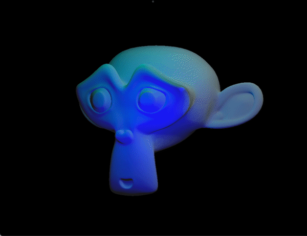
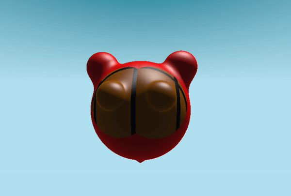

### Hi there 👋

<!--
**PlusLius/PlusLius** is a ✨ _special_ ✨ repository because its `README.md` (this file) appears on your GitHub profile.

Here are some ideas to get you started:

- 🔭 I’m currently working on ...
- 🌱 I’m currently learning ...
- 👯 I’m looking to collaborate on ...
- 🤔 I’m looking for help with ...
- 💬 Ask me about ...
- 📫 How to reach me: ...
- 😄 Pronouns: ...
- ⚡ Fun fact: ...
-->

<p>
  My name is Jiahao and I am a front-end developer who enjoys tinkering with various interesting technologies and devices, even if their practical uses have not been discovered yet.
  <br/>
  我叫嘉皓是一名喜欢折腾各种有趣但尚未发现有什么实际用途技术装置的前端开发者，
</p>
<p>
  I hope to be able to apply these technologies and devices to generate real value for production in the near future!
  <br/>
  希望在不久的将来能用这些技术装置来为生产带来实际的价值！
</p>


```glsl
vec3 Bounce(vec3 pos, float time) {
  float bounce = sin(time * 4.0);

  float deform = smoothstep(-1.0, -0.0, bounce);
  deform = mix(1.5, 1.0, deform);

  pos *= vec3(deform, 1.0/deform, deform);
  pos += vec3(0.0, bounce, 0.0);
}
```




